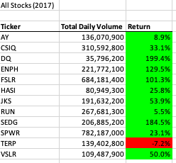
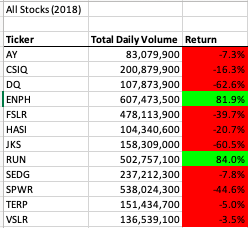
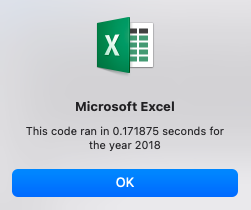

# Stock-Analysis

## Overview of Project
This prject is creating a tool using Excel Developor to analize the sucess of stocks. The initial worksheet built, functions fully. Now with scalability in mind, this project required code to be refactored to run more efficiently. The goal was to reduce the script excecution time, utilize less memory and use less code, where possible. 

## Results
In this analysis, I had to pull stock information from the dataset to create a chart that tells us the name of the stock, the Total Daily Volume and the average return of the stock over a one year periiod. Here is what we found. 

In 2017, all stocks, except TERP has a positive return. DQ outperformed all other stocks with a 199.4% return followed by SEDG at 184.5% 

After Factoring--"This code ran in 0.1679688 seconds for the year 2017"
Before refactoring--"This code ran in 0.171875 seconds for the year 2018. This is over a 1 second difference. 

In 2018, all but two stocks (ENPH and RUN) have a negetive returns. DQ was the stock that suffered the most, folled by JKS. ENPH and RUN both had over 80% return. 

Phis cpde ran in1.121094seconds for the year2018.
After refactoring--"This code ran in 0.171875 seconds for the year 2018. T
Befor refactoring te codr ran in in 1.121094 seconds for the year 2018. This is also about a 1second time difference. 

Refactoring has helped to shorten the length of time spent in procesing, which allows our the client to do  full stock market analysis within reasonable time. 

With such a stalk difference in returns between the two years, it is important to ask questions about the economy. 

## Summary

### Advantages of refactoring code in general
Refactoring code improves the scripts processing. It allows for code to work more smoothly and with less code/complexity.
It helps with the readability of the code and an help wth makeing the code less complex.

### Disadvantages of refactoring code in general
Refactoring code can be time consuming.  

### Advantages of the original and refactored VBA script
Refactoring the code will support the scripts ability to work efficiently with a larger data set. 

### Disadvantages of the original and refactored VBA script
A disadvantage is that it was easy to loose functionality of the code when making somewhat of a subtle change and introduce bugs. 
